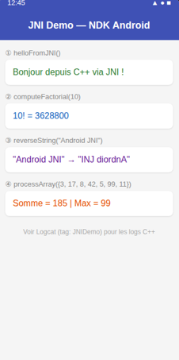

#  LAB JNI — JNIDemo : Communication Java ↔ C++ via NDK

> **Cours** : Programmation Mobile — Android avec Java  
> **Étudiante** : Sara Jamiri  

---

##  Objectifs pédagogiques

1. Créer un projet Android avec support C++ (NDK)
2. Comprendre le rôle du NDK, de CMake et de JNI
3. Déclarer et appeler des méthodes natives depuis Java
4. Manipuler des types simples et complexes entre Java et C++
5. Gérer des erreurs fréquentes comme `UnsatisfiedLinkError`
6. Lire les logs natifs dans Logcat
7. Appliquer de bonnes pratiques pour JNI

---

##  Démonstration



---

##  Architecture JNI

```
MainActivity.java
      │
      │  appelle méthode native
      ▼
System.loadLibrary("native-lib")
      │
      │  charge libnative-lib.so
      ▼
native-lib.cpp (C++)
      │
      │  exécute le traitement
      ▼
retourne le résultat → Java → UI
```

---

##  Les 4 fonctions démontrées

| # | Fonction Java | Résultat |
|---|---|---|
| ① | `helloFromJNI()` | `Bonjour depuis C++ via JNI !` |
| ② | `computeFactorial(10)` | `10! = 3628800` |
| ③ | `reverseString("Android JNI")` | `"INJ diordnA"` |
| ④ | `processArray({3,17,8,42,5,99,11})` | `Somme = 185 | Max = 99` |

---

##  Structure du projet

```
app/
├── src/main/
│   ├── cpp/
│   │   ├── CMakeLists.txt       ← Configuration build C++
│   │   └── native-lib.cpp       ← Code natif C++ (4 fonctions JNI)
│   ├── java/com/sara/jnidemo/
│   │   └── MainActivity.java    ← Déclaration + appel méthodes natives
│   └── res/layout/
│       └── activity_main.xml    ← UI affichant les 4 résultats
└── build.gradle                 ← Config NDK + CMake
```

---

##  Règle de nommage JNI

```cpp
// Java_<package>_<classe>_<méthode>
Java_com_sara_jnidemo_MainActivity_helloFromJNI
```

---

##  Extraits de code clés

### Java — Déclaration native
```java
static { System.loadLibrary("native-lib"); }

public native String helloFromJNI();
public native long computeFactorial(int n);
public native String reverseString(String input);
public native String processArray(int[] arr);
```

### C++ — Implémentation JNI
```cpp
extern "C" JNIEXPORT jstring JNICALL
Java_com_sara_jnidemo_MainActivity_helloFromJNI(JNIEnv *env, jobject) {
    return env->NewStringUTF("Bonjour depuis C++ via JNI !");
}
```

---
